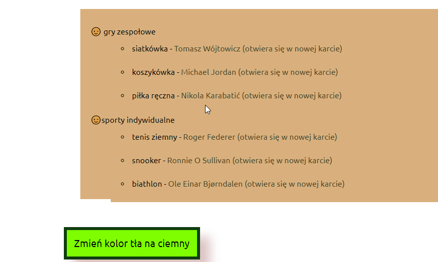

# Adrian Sikorski -about yourself
## Adrian Sikorski - interests
https://radian31.github.io/homepage1/

## Description
Welcome to my website.When creating it, I used the BEM method.Javascript was also used using the ECMA ES 2021 standardized object specification.
 You can find out some information about me, where I come from, where I currently live and what I do on a daily basis.
In addition, you will learn about my interests.
The operation of the site is quite simple.
At the top is the navigation that takes you to the topic of the page. If you like reading crime books, you will definitely enjoy my items.
There is also something for sports fans. You will find out what disciplines I support and you will also read about their stars.

At the very end, you can change the background color of the entire page using the button.
I am attaching a gif showing the button that has just been activated and also the luminance of the link to information about sports stars.

